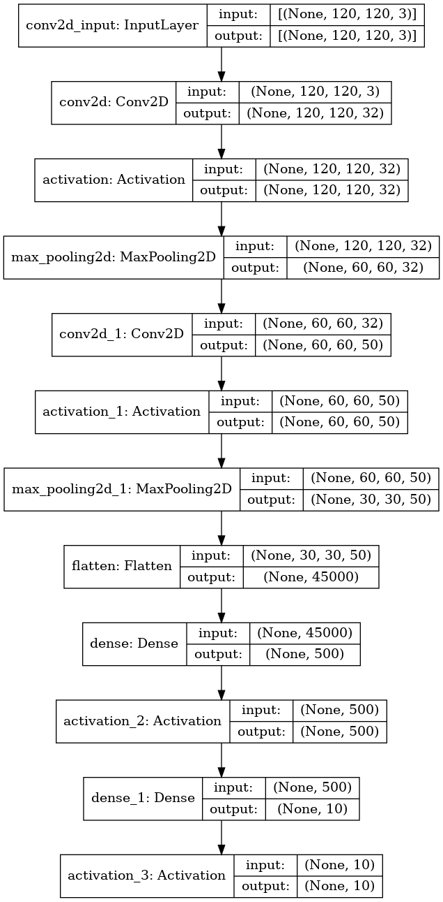

# Assignment 5 - Classification benchmarks
**Christoffer Kramer**  
**10-04-2021**  
Multi-class classification of impressionist painters  
So far in class, we've been working with 'toy' datasets - handwriting, cats, dogs, and so on. However, this course is on the application of computer vision and deep learning to cultural data. This week, your assignment is to use what you've learned so far to build a classifier which can predict artists from paintings.  
You can find the data for the assignment here: https://www.kaggle.com/delayedkarma/impressionist-classifier-data  
Using this data, you should build a deep learning model using convolutional neural networks which classify paintings by their respective artists. Why might we want to do this? Well, consider the scenario where we have found a new, never-before-seen painting which is claimed to be the artist Renoir. An accurate predictive model could be useful here for art historians and archivists!  
For this assignment, you can use the CNN code we looked at in class, such as the ShallowNet architecture or LeNet. You are also welcome to build your own model, if you dare - I recommend against doing this.  
Perhaps the most challenging aspect of this assignment will be to get all of the images into format that can be fed into the CNN model. All of the images are of different shapes and sizes, so the first task will be to resize the images to have them be a uniform (smaller) shape.  
You'll also need to think about how to get the images into an array for the model and how to extract 'labels' from filenames for use in the classification report

## How to run  
**Step 1: Clone repo**  
- open terminal  
- Navigate to destination for repo  
- type the following command  
```console
 git clone https://github.com/Chris-Kramer/visual_assignments.git
```  
**step 2: Run bash script:**  
- Navigate to the folder "assignment-5".  
```console
cd assignment-5
```  
- Use the bash script _run_cnn-artists.sh_ to set up environment and run the script:  
```console
bash run_cnn-artists.sh
```  
The bash script will print out a performance report and save a summary and a graph in the folder _output_.

**Note:** Because of limitations regarding data storage on git, I'm only using a very small slice of the data. So the performance is attrociosly bad (around 18%). Moreover, when resizing images you might encounter the following warning "Corrupt JPEG data: 10 extraneous bytes before marker 0xd9". Ignore this, since it just means, that one of the images is corrupted.    

## Using custom data
This script is intendended to be a _quick-n-dirty_ deep learning model, that is easy to employ on different data sets. The only requirement is, that the test and training data is located in the "data" folder. You can either use data that has already been split between training and test data, or use a data set that needs to be split. The script will automatically resize the images, get x and y data, and find label names (based on the folder names). NOTE: The files in the category folders must only be image files. So make sure, that there aren't any txt, readme or csv files in the folders. 

### Splitted data
If your data is already split it needs to follow the structure below. The names doesn't matter just the structure. 

- Training_data_dir
    - category_1_dir
        - image_1.jpg
        - image_2.jpeg
        - image_3.png
    - category_2_dir
        - image_1.jpg
        - image_2.jpeg
        - image_3.png
        
- test_data_dir
    - category_1_dir
        - image_1.jpg
        - image_2.jpeg
        - image_3.png
    - category_2_dir
        - image_1.jpg
        - image_2.jpeg
        - image_3.png
        
### Unsplit data
If the data isn't split, it needs to follow the structure below:
- data_dir
    - category_1_dir
        - image_1.jpg
        - image_2.jpeg
        - image_3.png
    - category_2_dir
        - image_1.jpg
        - image_2.jpeg
        - image_3.png
         
You can specify if your data needs to be split or not with the parameters below.  
If you want to try a data set that is unsplit I have added a data set called "shapes" in the data folder. 

## Parameters
I added a lot of parameters to so the model can be customized. It has default values for all parameters. If you wan't to fiddle around with the model I suggest taking a look at the picture  below so you can see how many layers there are and what types of layers there are.   
  

- `split_data` Use this flag if you need to split the data in training and test data. It takes a folder as input. The folder must be located in the 'data' folder. The train-split divide will be 80/20%. If you use this flag, you cannot use the flags "train_data" and "test_data" (it makes no sense to both have splitted and unsplitted data).  
    - DEFAULT = None  
- `train_data` The folder with training data. Must be a subfolder in the 'data' folder (Use this if your data is already splitted)
    - DEFAULT = small_training   
- `validation_data` The folder with validation data. Must be a subfolder in the 'data' folder (use this if your data is already splitted).  
    - DEFAULT = small_validation.  
- `architecture_out` The filename of the output image containing the model architecture. The image will be located in the "output" folder.
    - DEFAULT = model_architecture.png  
- `performance_out` The filename for output plot over performance. It will be located in the folder "output".  
    - DEFAULT = performance.png  
- `image_size` The dimensions of resized pictures as a list of ints. First value represents height, second value represents width.  
    - DEFAULT = 120 120  
- `kernel_size` The size of the convolutionals kernels that are used in the first and second layer conv2d layer (called _conv2d_ and _conv2d_1_ in the picture above). Values are given as a list of ints (with a lenght of 2). First value represents the kernel size in conv2d the second value represents the kernel size in conv2d_1.  
    - DEFAULT = 3 5 (3x3 and 5x5)  
- `filters` The number of filters in the convolutional layers (there are two). The argument is a list of ints (length of two). First value is amount of filters in the first conv2d layer (conv2d). Second value is amount of filters in the second conv2d layer (conv2d_1).  
    - DEFAULT = 32 50  
- `pool_size` The pool size for the two pooling layers (max_pooling2d and max_pooling2d_1). The argument is a list of ints (length of two). First value represents pool size in the first pooling layer (max_pooling2d), second value represents pool size in the second pooling layer (max_pooling2d_1).  
    -DEFAULT = 2 2 (2x2 and 2x2)  
- `strides` The strides in the two pooling layers (max_pooling2d and max_pooling2d_1). The argument is a list of ints (length of two). First value represents strides in the first pooling layer (max_pooling2d), second value represents strides in the second pooling layer (max_pooling2d_1).  
    - DEFAULT = 2 2 (2x2 and 2x2)  
- `padding` The padding type for each convolutional layer. The argument is a list of strings (length of two). First value is the padding in the first conv2d layer (conv2d). Second value is the padding in the second conv2d layer (conv2d_1). I recommend that you don't change these. You can learn more about tensorflows padding types here: https://www.tensorflow.org/api_docs/python/tf/nn/conv2d.  
    - DEFAULT = same same  
- `activation_layers` The activation function in each activation layer (There are four). Arguments are given as a list of strings. First value represents first actication layer (activation), second value represents second activation layer (activation_1), third value represents the third activation layer (activation_2). The fourth layer represents the output activation layer (activation_3). I recommend not chaning these, unless you are doing binary classification. You can read more about tensorflows acitivation layers here: https://keras.io/api/layers/activations/  
    - DEFAULT = relu relu relu softmax  
- `learning_rate` The learning rate for stochastic gradient descent. This is used in the optimzer.  
    - DEFAULT = 0.01  
- `batch_size` The batch size processing.  
    - DEFAULT = 32
- `epochs` The number of epochs that should run. 
    - DEFAULT = 20  

Example:  
```console
bash run_cnn-artists.sh --split_data shapes --architecture_out shapes_arch.jpg --performance_out shapes_performance.jpg --image_size 28 28 --kernel_size 3 3 --filters 15 30 --pool_size 3 3 --strides 3 3 --learning_rate 0.001  --batch_size 50 --epochs 21
```
## Running on windows
This script have not been tested on a Windows machine and the bash script is made for Linux/mac users. If you're running on a local windows machine, and don't have an Unix shell with bash, you have to set up a virtual environment, activate it, install dependencies (requirements.txt) and then run the scripts manually from the src folder.